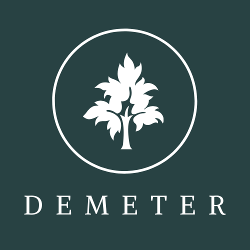
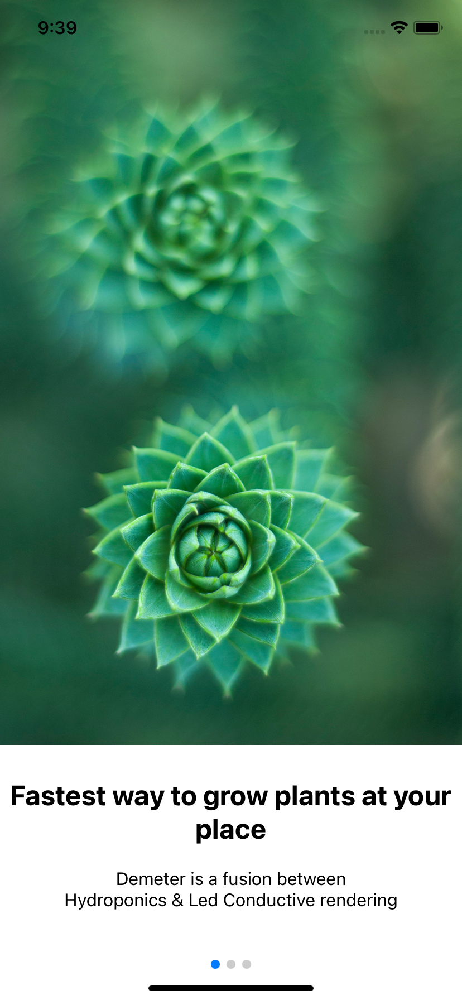
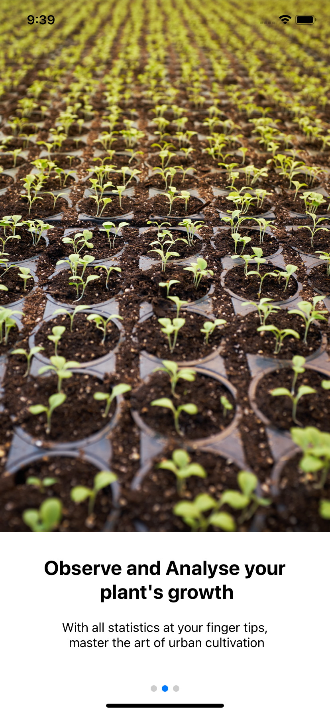
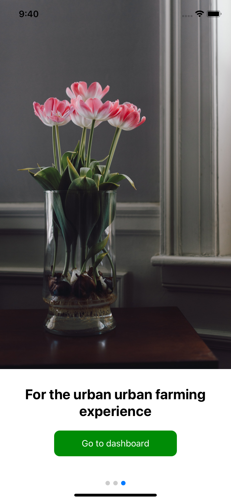
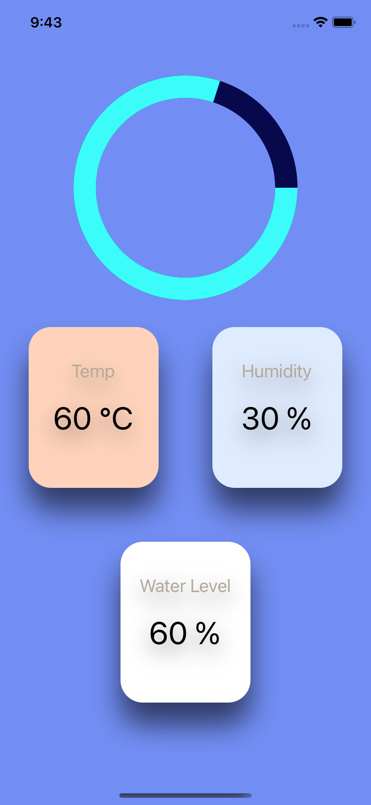

    

## The Problem

---

The global population is expected to hit the threshold of **9.5 billion by 2050**, and by that time _50%_ of the arable lands on this planet will be rendered useless.

In order to cater to the growing demand of an _efficient and technologically advanced agricultural monitoring and enhancement system_, Demeter plays a vital role in solving the crisis of status quo. Since we opt for a soil free environment for cultivating a vast array of crops (both leguminous and non-leguminous) and cherishes the ecosystem/ we cannot use anything that we can’t eat to stimulate the plant growth.

## Target Audience

---

Only an expert gardener knows how difficult it can be to grow plants and how much extra care it takes with special attention to soil, fertilizer and light. One can’t get the process right and expect good yields without getting his/her hands dirty.

But, to make their work a lot easier and convenient, many start-ups in India are working on hydroponics farming, such as:

- Major vegetable produce retail outlets - Reliance Fresh, VegVillage, Ansio etc.

- Retail companies like Burger king, KFC, MCDonalds, to name a few.

- Farming enthusiasts, including government officials,youths and business men, in urban and semi urban areas.

## Current applications

---

In the middle of an industrial building in the Andheri East neighbourhood of Mumbai is a farm. It is spread across 1,000 sq ft and grows 2,500 plants. It is no ordinary farm. The hum of an air conditioner greets visitors into the room, tube lights replace sunlight, and there’s no soil on the patch.

In recent years, the business world has become rapidly integrated across once restricting borders, and anyone with high goals in the business world must have an international perspective and be aware of the realities of different international arenas.

> As consumers become increasingly aware of the superior quality in greenhouse-grown vegetables, the demand for hydroponics has been growing in Europe and Asia-Pacific. Hydroponics crop production is expected to continue growing when it comes to tomatoes, lettuce and other leafy vegetables. Experiments with creeper plants have also been quite promising, and it won’t be long before we have large scale cultivation of fruit like grapes and plums using hydroponics.

Having worked with the modern sophisticated Hydroponics and colour rendering systems to stimulate plant growth and generate the most fresh produce possible for all the retail outlets, _Demeter aims to garner our customer’s interest and trigger their inquisitiveness with respect to redefining the borders of what constraints lie around urban farming_, especially for those who wish to practice agriculture as a hobby but are unable to do so owing to space limitations or inadequate sunlight and any other such shortcomings.

## Deconstructing misconceptions

---

_Most people in India have grown up on the idea that good water, good soil and lots of sunlight translate into good farming._

That may have been true for most farmers, for a great deal of time.

> But new research and practice have shown that what healthy plants really require are good seeds, good water and nutrients.

**Plants do not really require soil.** And plants **do not need sunlight, but spectrum**. The entire process of photosynthesis is possible when the plant separates the sunlight to soak in the spectrum that it requires. Broadly, different types of plants use blue, red or yellow spectrum. Some use white spectrum as well.

> Assuming that a generic sample of sunlight is optmium for growth of all categories of vegetation, is akin to believing something as baseless as "Vegetarian diet is the most suited diet for the entire Human Population."

## How to run the project

---

The project consists of two parts, the server (created using NodeJS) and the mobile application (developed using React Native).

### Setting up the Server

    # Clone the repo
    git clone https://github.com/LightningNemesis/Demeter.git
    cd Demeter/server

    # Install yarn dependencies
    yarn

    # Running the server
    yarn run dev

### Setting up the App

    # Clone the repo
    git clone https://github.com/LightningNemesis/Demeter.git
    cd Demeter/app

    # Install yarn dependencies
    yarn

    # Running the application (Android)
    npx react-native run-android

    # Running the application (iOS)
    (Note: you require macOS with XCode installed before running the application)
    npx react-native run-ios

    # Install the podfile dependencies
    cd ios && pod install && ..

## App Screenshots

|            Preview 1            |            Preview 2            |
| :-----------------------------: | :-----------------------------: |
|  |  |
|   :-------------------------:   |   :-------------------------:   |
|            Preview 3            |            Dashboard            |
|   :-------------------------:   |   :-------------------------:   |
|  |  |

---
